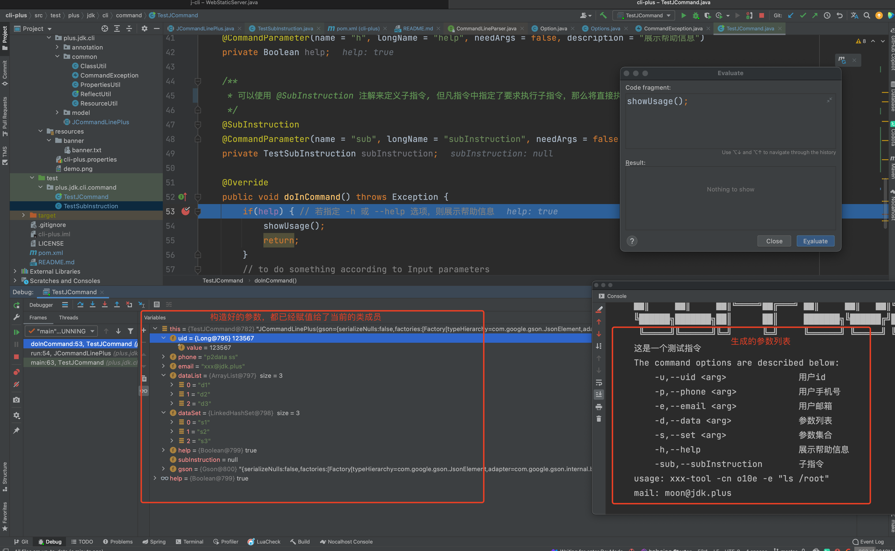

<p align="center">
    
</p>
<h3 align="center">Cli-Plus - 使用Java编写命令行指令</h3>
<p align="center">
    <a href="https://github.com/JDK-Plus/cli-plus/blob/master/LICENSE"></a>
    <a href="https://github.com/JDK-Plus/cli-plus/releases"></a>
    <a href="https://github.com/JDK-Plus/cli-plus/stargazers"></a>
    <a href="https://github.com/JDK-Plus/cli-plus/network/members"></a>
</p>
<p align="center">Cli-Plus是一款开源的使用Java编写命令行指令的框架，它具有简单、高效、易用等特点。</p>


# 简介
这是一款使用java编写命令行指令集的框架。

详细的使用说明请参见: https://jdk.plus/pages/2ba02f/

- [English](README.md)

## 如何引入

```xml
<dependency>
    <groupId>plus.jdk</groupId>
    <artifactId>cli-plus</artifactId>
    <version>1.0.9</version>
</dependency>
```

## 定义指令并指定参数

**如何定义一个指令：**

```java
package plus.jdk.cli.command;

import plus.jdk.cli.JCommandLinePlus;
import plus.jdk.cli.annotation.CommandLinePlus;
import plus.jdk.cli.annotation.CommandParameter;
import plus.jdk.cli.annotation.SubInstruction;

import java.util.List;
import java.util.Set;

@CommandLinePlus(description = "这是一个测试指令")
public class TestJCommand extends JCommandLinePlus {

    /**
     * 你可以使用required参数指定该项必须输入， 调用已经实现的validate() 函数去对参数做出校验
     */
    @CommandParameter(name = "u", longName = "uid", needArgs = true, description = "用户id", required = true)
    private Long uid;

    @CommandParameter(name = "p", longName = "phone", needArgs = true, description = "用户手机号")
    private String phone;

    /**
     * 对于简单类型，你可以使用, -<name> 或 --<longName> 指定参数，例如：-e xxx@jdk.plus, 或 --email xxx@jdk.plus
     */
    @CommandParameter(name = "e", longName = "email", needArgs = true, description = "用户邮箱")
    private String email;

    /**
     * 你可以使用多个选项来指定列表,例如 : -d d1 -d d2 --data d3
     */
    @CommandParameter(name = "d", longName = "data", needArgs = true, description = "参数列表")
    private List<String> dataList;

    /**
     * 你可以使用多个选项来指定列表,例如 : -s d1 -s d2 --set d3
     */
    @CommandParameter(name = "s", longName = "set", needArgs = true, description = "参数集合")
    private Set<String> dataSet;

    /**
     * 针对不需要参数的选项，你可以使用Boolean类型来接收，例如指定 -h 或 --help, 该值会被赋值为true,否则为false
     */
    @CommandParameter(name = "h", longName = "help", needArgs = false, description = "展示帮助信息")
    private Boolean help;

    /**
     * 可以使用 @SubInstruction 注解来定义子指令, 但凡指令中指定了要求执行子指令，那么将直接执行子指令中的逻辑，不再执行当前指令中的任务
     */
    @SubInstruction
    @CommandParameter(name = "sub", longName = "subInstruction", needArgs = false, description = "子指令")
    private TestSubInstruction subInstruction;

    @Override
    public void doInCommand() throws Exception {
        if(help) { // 若指定 -h 或 --help 选项，则展示帮助信息
            showUsage();
            return;
        }

        validate();

        // to do something according to Input parameters
        // which has been assigned to a member variable
    }

    public static void main(String[] args) throws Exception {
        TestJCommand testCommand = new TestJCommand();
        testCommand.run(args);
    }
}
```

**执行**

```bash
java -jar xxx.jar -u 123567 -p "p2data ss" --email xxx@jdk.plus -h -s s1 -s s2 --set s3 -d d1 -d d2 --data d3
```

**按照上文所述的参数传递，执行的效果如下**



**配置文件**

你需要在你的工程`resources`目录下指定`cli-plus.properties`。

> 当然，不指定也是可以的，会使用我们提供的默认配置

```bash
plus.jdk.help.header.welcome=Welcome to use cli-plus
plus.jdk.help.header.description=The command options are described below:
plus.jdk.help.footer.description=usage: xxx-tool -cn xx -e "ls /root"
plus.jdk.help.footer.contact=mail: moon@jdk.plus
```

**如何展示指令以及子指令的帮助信息**

调用封装好的`showUsage`方法可以生成帮助信息并打印，示例如下：


> 当然，如果你对这个样式不满意，你可以重写`showUsage`方法来自定义你的指令集的帮助信息

## 关于指令的shell封装

```shell
#!/bin/bash

# 指定运行时的JAVA_HOME
#JAVA_HOME=${HOME}/.biz-tools/java-se-8u41-ri
#PATH=${JAVA_HOME}/bin:$PATH

if ! which java > /dev/null ; then
    echo "jdk 未安装, 请安装1.8以上版本"
    exit
fi

JAVA_VERSION=$(java -version 2>&1 | sed '1!d' | sed -e 's/"//g' | awk '{print $3}')

if [[ ! "${JAVA_VERSION}" =~ ^1.8.0.* ]]; then
    echo "jdk版本必须大于等于1.8，请检查环境配置"
    exit
fi

TOOLS_JAR=$(dirname "$0")/tools.jar

# shellcheck disable=SC2046
java -jar "${TOOLS_JAR}" "$@" -c $(dirname "$0")/conf/config.properties
```
## 如何读取你的配置

我们封装了`initializationConfig`函数来帮你读取配置,该函数可以配合`PropertiesValue`注解使用，将配置内容转为实体类的配置。

**定义实体类**

```java
package plus.jdk.cli.model;

import lombok.Data;
import plus.jdk.cli.annotation.PropertiesValue;

@Data
public class CliHelpModel {

    /**
     * header欢迎使用的标题
     */
    @PropertiesValue("plus.jdk.help.header.welcome")
    private String headerWelcome;

    /**
     * 想要展示的banner信息
     * 你可以使用 resource 和 path参数指定要输出的banner位置
     */
    @PropertiesValue(value = "plus.jdk.help.header.banner", resource = true, path = "banner/banner.txt")
    private String banner;

    /**
     * header描述信息
     */
    @PropertiesValue("plus.jdk.help.header.description")
    private String headerDesc;

    /**
     * 底部描述信息
     */
    @PropertiesValue("plus.jdk.help.footer.description")
    private String footerDesc;

    /**
     * 联系信息
     */
    @PropertiesValue("plus.jdk.help.footer.contact")
    private String footerContact;
}
```

如你所见，配置中的内容就会根据的你的注解修饰将值赋给该实体类的成员变量

**读取配置：**

```java
import static plus.jdk.cli.common.PropertiesUtil.initializationConfig;
//...
CliHelpModel cliHelpModel = initializationConfig(CliHelpModel.class, "cli-plus.properties", true);
//...
```

## 添加对特殊类型的支持

如果你的输入参数需要指定一些自定义类型(目前仅支持 `Boolean`、`Long`、`String`、`Integer`四种)。

### 自定义自己的类型适配器

你可以通过实现`ITypeAdapter`接口来自定义相关序列化的功能。示例如下,下面是一个关于`Long`类型序列化实现的示例：

```java
package plus.jdk.cli.type.adapter;

import com.google.gson.TypeAdapter;

public class LongTypeAdapter implements ITypeAdapter<Long> {
    @Override
    public Long deserialize(String dataStr) {
        if(dataStr == null) {
            return null;
        }
        return Long.parseLong(dataStr);
    }

    @Override
    public String serialize(Long data) {
        if(data == null) {
            return null;
        }
        return String.valueOf(data);
    }
}
```

### 注册实现的适配器

```java
@CommandLinePlus(description = "这是一个测试指令")
public class TestJCommand extends JCommandLinePlus {
    
    // ...
    
    public static void main(String[] args) throws Exception {
        TestJCommand testCommand = new TestJCommand();
        // 在完成调用前注册自己实现的适配器组件
        Options.registerTypeAdapter(Long.class, new LongTypeAdapter()); 
        testCommand.run(args);
    }
}
```

